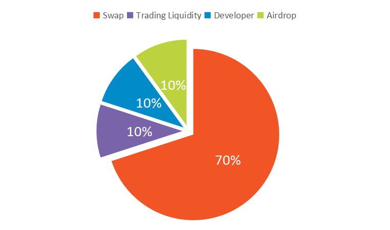
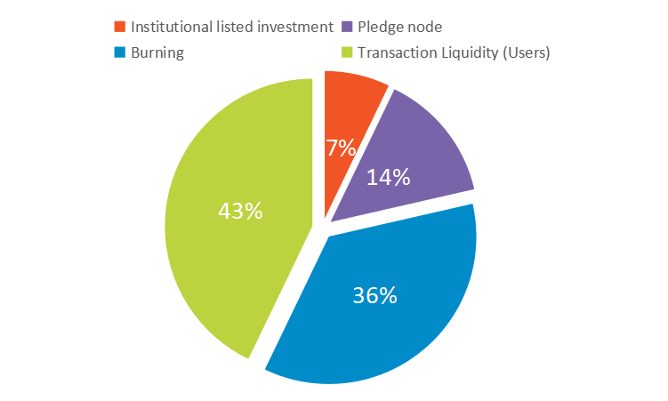

# Distribution

### BLDX Token Distribution

<table data-view="cards"><thead><tr><th align="center"></th><th align="center"></th></tr></thead><tbody><tr><td align="center">Total Circulation</td><td align="center">200,000,000</td></tr><tr><td align="center">Swap</td><td align="center">140,000,000</td></tr><tr><td align="center">Trading Liquidity</td><td align="center">20,000,000</td></tr><tr><td align="center">Development Team Stock Pool</td><td align="center">20,000,000</td></tr><tr><td align="center">Airdrop</td><td align="center">20,000,000</td></tr></tbody></table>

<figure><figcaption></figcaption></figure>

### Swap Pool Distribution



Transaction Liquidity (Users). Used in Blockdx B, L mode transactions.



Use 10% of transaction fees to burn tokens



Users exchange BNB for BLDX in order to participate in the pledge node.



Organs participate in 10 million BLDX tokens in order to list BLDX on international exchanges.



<figure><figcaption></figcaption></figure>

### Developer Distribution



Locked for 400 days, get 0.25% every day whthin 400 days.



Locked for 3 years, and get 0.25% every day after 3 years, for a total of 400 days.


