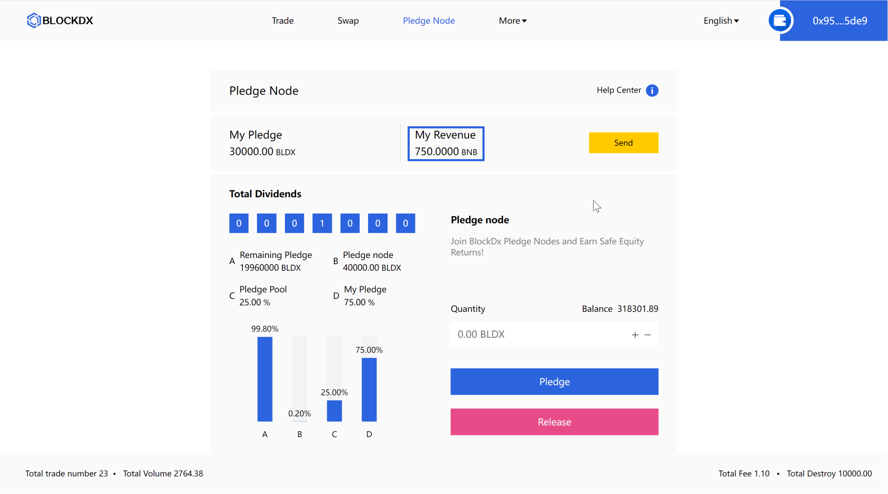
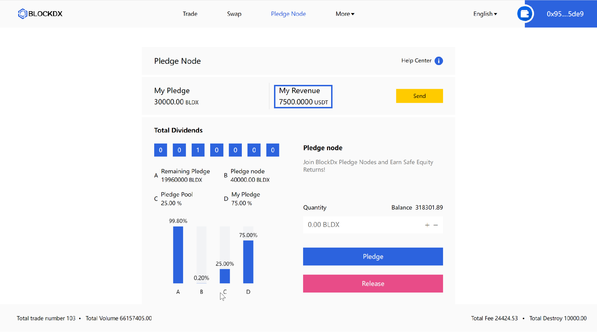
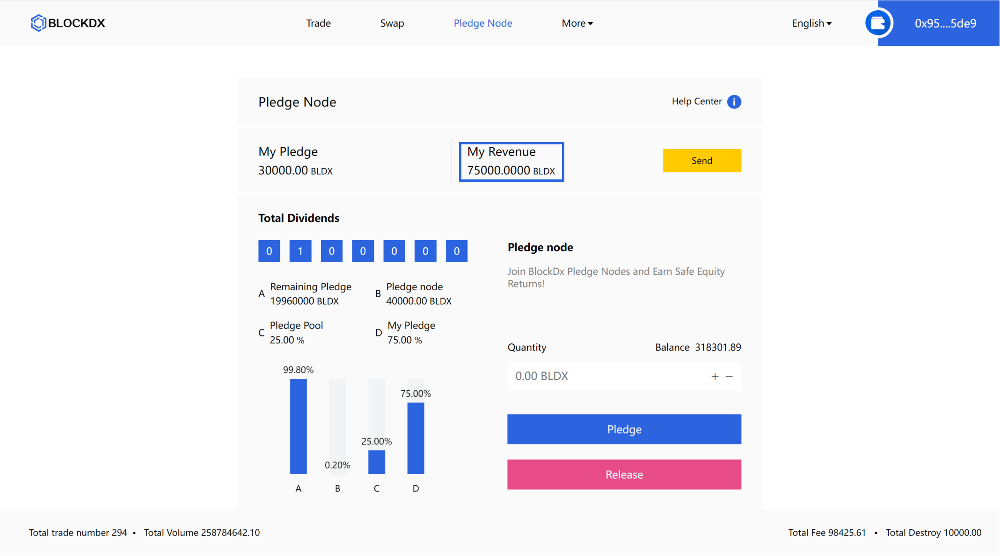

# 🧲 Pledge Node


**Important note:** Please be aware that our platform can only be used after being accessed on the Dapp at present, the content and technical specifications of this chapter are subject to change.


<figure><figcaption>
Equity participants run BlockDx pledge nodes with BLDX tokens and receive 20% of BNB trading fees in a 1/N proof-of-stake method. Click send to transfer to personal wallet in real time
</figcaption></figure>

<figure><figcaption>
Equity participants run BlockDx pledge nodes with BLDX tokens and receive 20% of USDT trading fees in a 1/N proof-of-stake method. Click send to transfer to personal wallet in real time
</figcaption></figure>

<figure><figcaption>
Equity participants run BlockDx pledge nodes with BLDX tokens and receive 20% of BLDX trading fees in a 1/N proof-of-stake method. Click send to transfer to personal wallet in real time
</figcaption></figure>

## &#x20;[<mark style="color:blue;">Click here to join BlockDx Pledge Node</mark>](https://blockdx.pro/blockdx/dapp.html#/dividends)&#x20;
