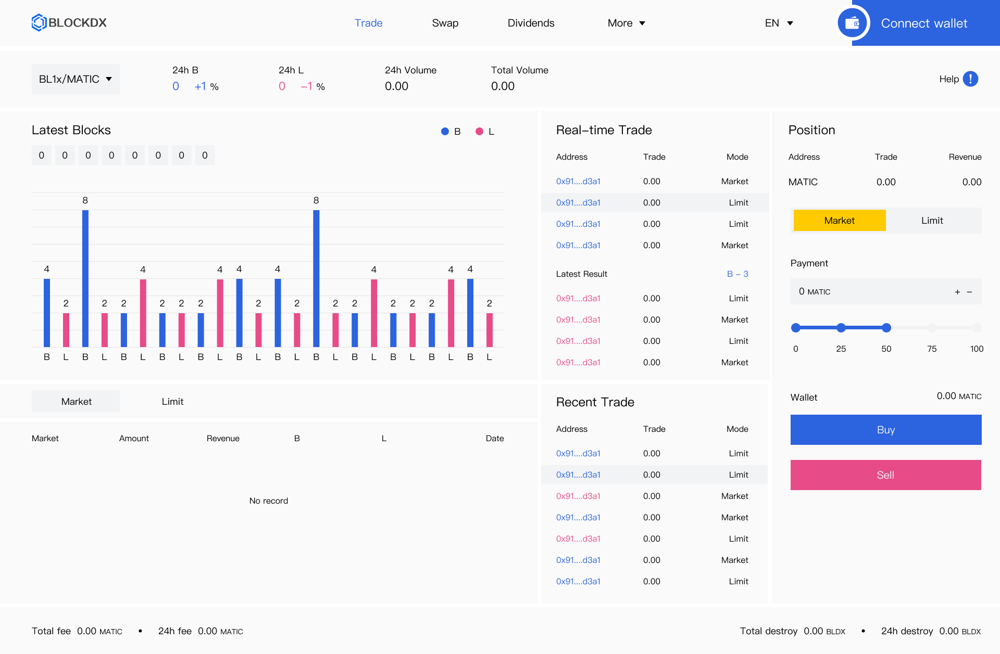
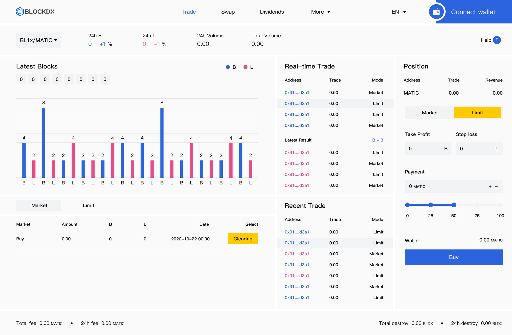

# 🚀 Getting Trade


**Important note:** Please be aware that our platform can only be used after being accessed on the Dapp at present, the content and technical specifications of this chapter are subject to change.


<figure><figcaption>
Market Trade: one-time trade with block trade logic.
</figcaption></figure>

<figure><figcaption>
Limit Trade: Trade according to the take profit and stop loss data set by yourself
</figcaption></figure>

<figure><figcaption>
Check your trade contract
</figcaption></figure>
