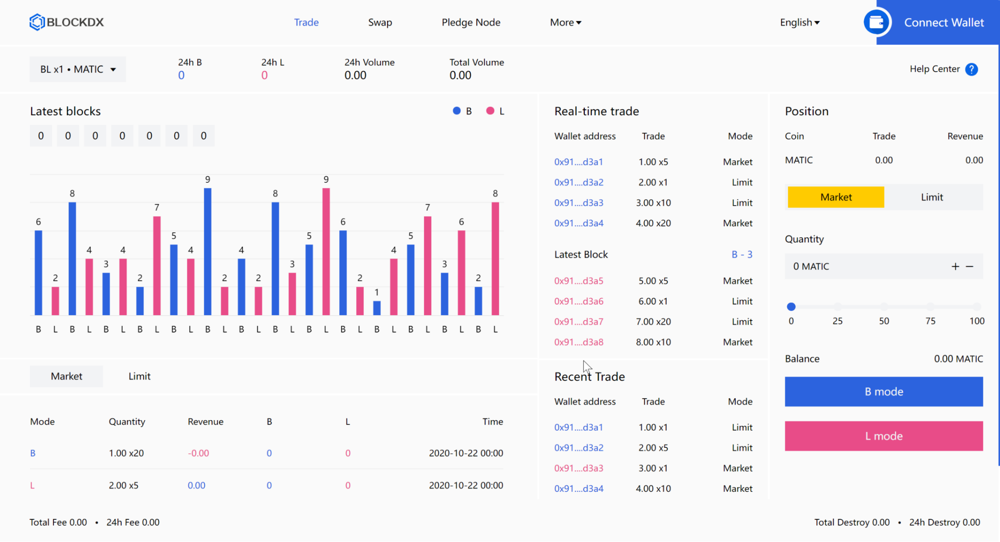
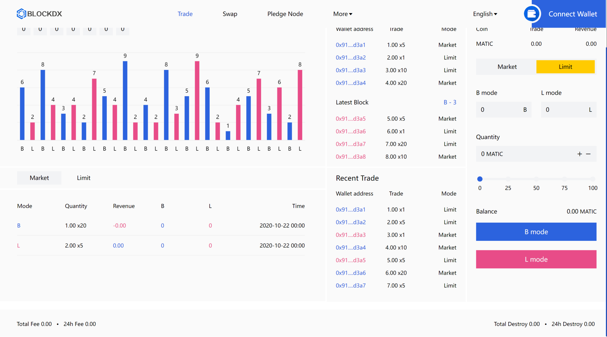
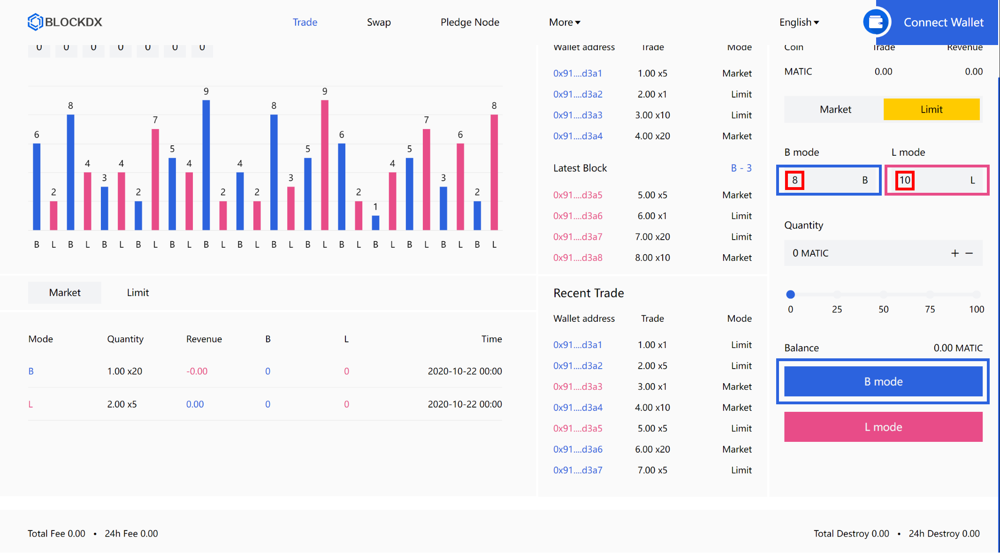
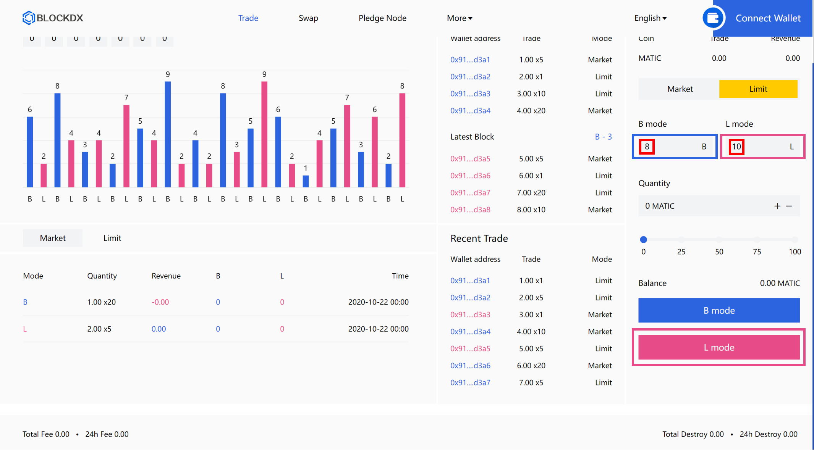
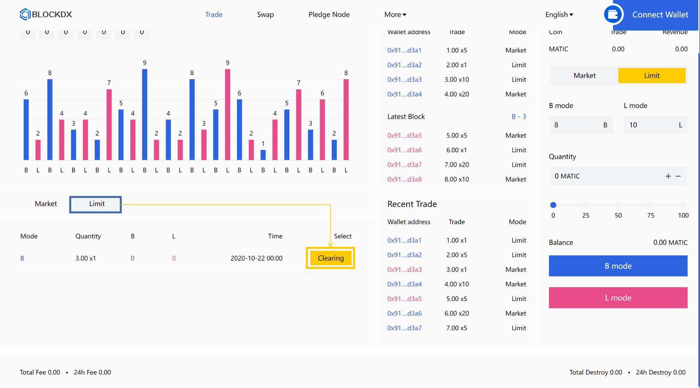

# 🔑 Getting Trade


**Important note:** Please be aware that our platform can only be used after being accessed on the Dapp at present, the content and technical specifications of this chapter are subject to change.


#### Market Trade

<figure><figcaption>
Market Trade: one-time trade with block trading logic. * At the end of the transaction, the [principal ± profit (loss)] of the corresponding position Matic will be transferred to the personal wallet in real time. (Transfer after deduction of fee)
</figcaption></figure>

#### Limit Trade

<figure><figcaption>
Limit Trade: Trade according to the take profit and stop loss data set by yourself * At the end of the transaction, the [principal ± profit (loss)] of the corresponding position Matic will be transferred to the personal wallet in real time. (Transfer after deduction of fee)
</figcaption></figure>

#### Limit Trade Example（B mode）

<figure><figcaption>
In the total trading volume of the contract, when (the number of settlements as B - the number of settlements as L) = 8, the contract is closed with a take profit. Conversely, when (the number of settlements as L - the number of settlements as B) = 10, the contract is closed with a stop loss.
</figcaption></figure>

#### Limit Trade Example（L mode）

<figure><figcaption>
In the total trading volume of the contract, when (the number of settlements as L - the number of settlements as B) = 10, the contract is closed with a take profit. Conversely, when (the number of settlements as B - the number of settlements as L) = 8, the contract is closed with a stop loss.
</figcaption></figure>

#### Limit Trade Example（Clearing positions manually）

<figure><figcaption>
Before the contract transaction is automatically closed, the position can be manually closed on the current page.
</figcaption></figure>

## <mark style="color:blue;"></mark>[<mark style="color:blue;">Go to Blockdex Trading</mark>](https://blockdx.pro/blockdx/dapp.html#/index)<mark style="color:blue;"></mark>
