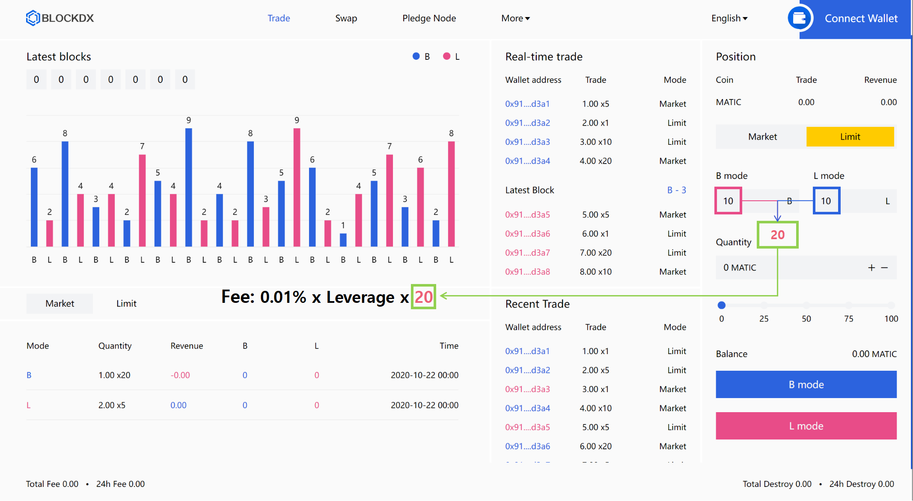

# Fees


#### Since our smart contract fund pool is designed to be very flexible, each smart contract fund pool can be freely selected by the initiator of the calling contract


#### Market Trade fee

<table data-card-size="large" data-view="cards"><thead><tr><th align="center"></th><th align="center"></th></tr></thead><tbody><tr><td align="center">Leverage Trade x1</td><td align="center">0.01% x 1</td></tr><tr><td align="center">Leverage Trade x5</td><td align="center">0.01% x 5</td></tr><tr><td align="center">Leverage Trade x10</td><td align="center">0.01% x 10</td></tr><tr><td align="center">Leverage Trade x20</td><td align="center">0.01% x 20</td></tr></tbody></table>

#### Limit Trade fee

<table data-card-size="large" data-view="cards"><thead><tr><th align="center"></th><th align="center"></th></tr></thead><tbody><tr><td align="center">  Trade x1</td><td align="center">0.01% x 1 x parameter(B+L)</td></tr><tr><td align="center">Leverage Trade x5</td><td align="center">0.01% x 5 x parameter(B+L)</td></tr><tr><td align="center">Leverage Trade x10</td><td align="center">0.01% x 10 x parameter(B+L)</td></tr><tr><td align="center">Leverage Trade x20</td><td align="center">0.01% x 20 x parameter(B+L)</td></tr></tbody></table>

<figure><figcaption>
<strong>Example</strong> 
</figcaption></figure>

#### Others

<table data-card-size="large" data-view="cards"><thead><tr><th align="center"></th><th align="center"></th></tr></thead><tbody><tr><td align="center">Swap</td><td align="center">1%</td></tr><tr><td align="center">Equity pledge release</td><td align="center">1%</td></tr></tbody></table>


The higher the leverage, the higher the fees

