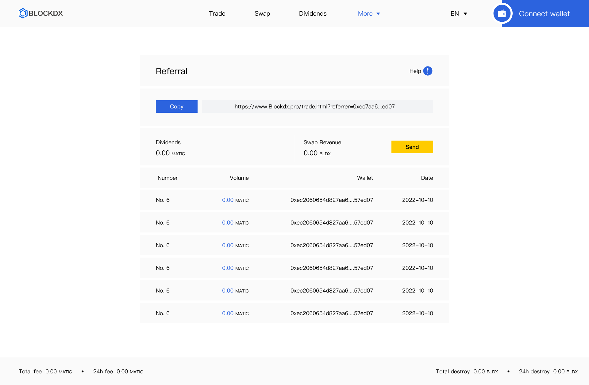

# 🦸♂ Referral


**Important note:** Please be aware that our platform can only be used after being accessed on the Dapp at present, the content and technical specifications of this chapter are subject to change.


<figure><figcaption>
Real-time distribution of referral's total trading fee income and details.
</figcaption></figure>


#### 50% of the commission generated by the referrer's transaction is distributed in real time as referral revenue.

