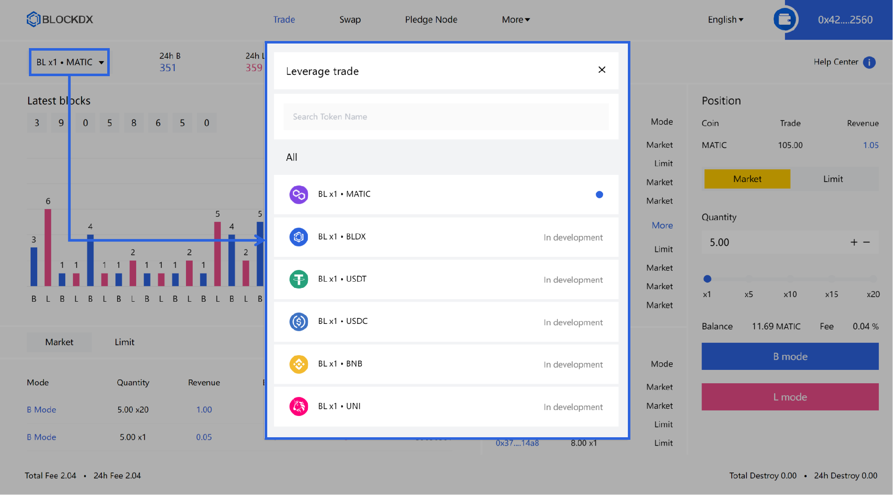

# 💡 Trading Guide

## Market Trade

#### 1. Choose the token to trade

<figure><figcaption></figcaption></figure>

#### 2. Enter the quantity to trade

<figure><figcaption></figcaption></figure>

#### 3. Choose leverage

<figure><figcaption></figcaption></figure>

#### 4. Choose one of the transaction modes

<figure><figcaption></figcaption></figure>

#### 5. After calling the smart contract, verify the data and confirm

<figure><figcaption></figcaption></figure>

#### 6. Invoke smart contract success or failure information

<figure><figcaption></figcaption></figure>

#### 7. After the transaction is successful, display the transaction information

<figure><figcaption></figcaption></figure>

## Limit Trade(Auto)

#### 1. Choose the token to trade

<figure><figcaption></figcaption></figure>

#### 2. Enter the take profit and stop loss parameters

<figure><figcaption>
 In the total trading volume of the contract, when (the number of settlements as B - the number of            settlements as L) = 5, the contract is completed with a take profit. Conversely, when (the number of      settlements as L - the number of settlements as B) = 2, the contract is completed with a stop loss.        
</figcaption></figure>

#### 3. Enter the quantity to trade

<figure><figcaption></figcaption></figure>

#### 4. Choose leverage

<figure><figcaption></figcaption></figure>

#### 5. Choose one of the transaction modes

<figure><figcaption></figcaption></figure>

#### 6. After calling the smart contract, verify the data and confirm

<figure><figcaption></figcaption></figure>

#### 7. Invoke smart contract success or failure information

<figure><figcaption></figcaption></figure>

#### 8. After the transaction is successful, display the transaction information

<figure><figcaption></figcaption></figure>

#### 9. Before the limit order is automatically completed, the position can be        manually cleared in real time

<figure><figcaption></figcaption></figure>
